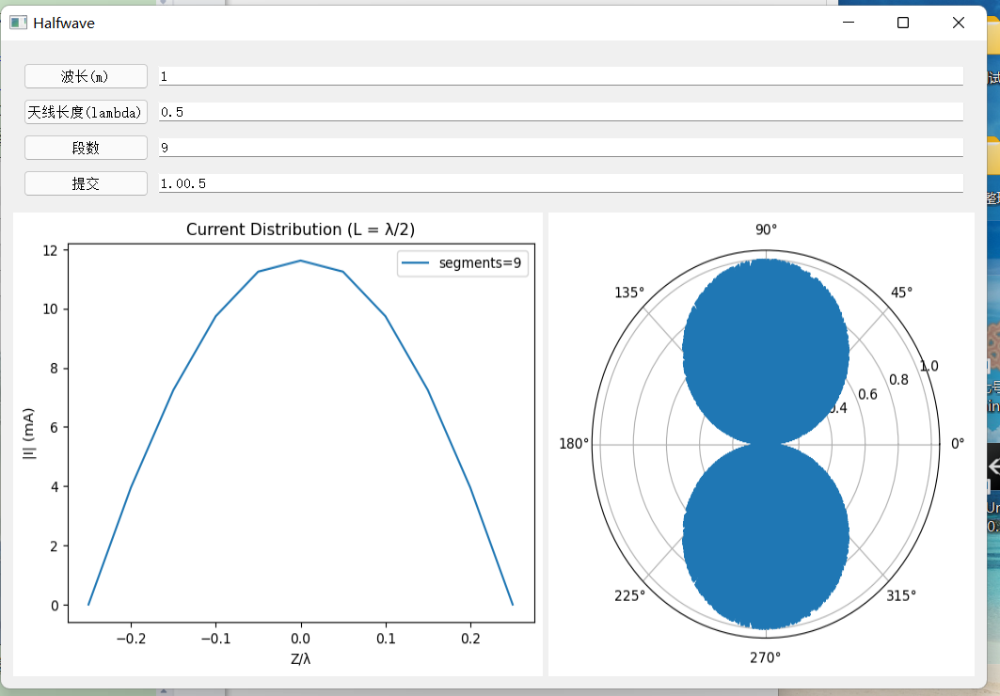
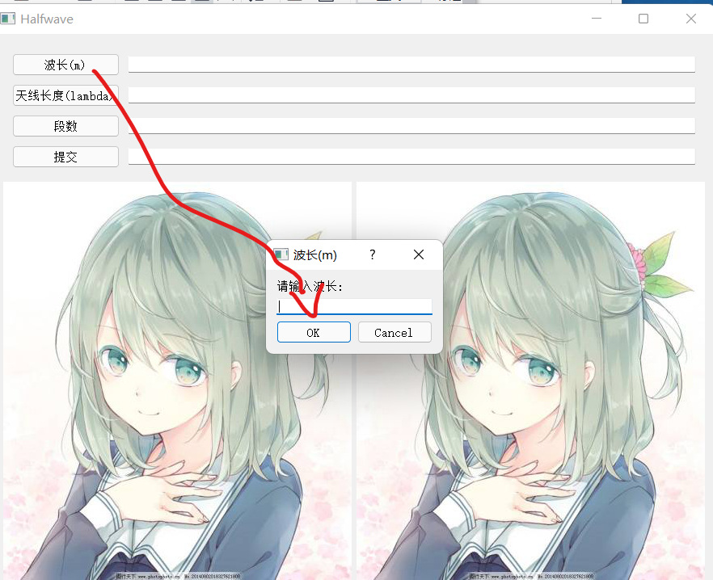

# dipole_antenna_momo_gui

## 代码说明

尝试用矩量法编写仿真偶极子的程序，结果包括电流分布和远场方向图。

主要参考了https://github.com/mateusnbm/dipole-antenna-mom ，然后自己改了一下代码的结构，用python的pyqt5库写了gui界面，补充了远场方向图的算法公式，最终效果如下图。

由于不太熟悉pyqt5，致使打包成exe文件后过大，所以在此仅给出了python代码。

该程序的展开函数为分域脉冲基函数，权函数选择了delta函数，用的公式是《简明天线教程》中的(6-16)式。